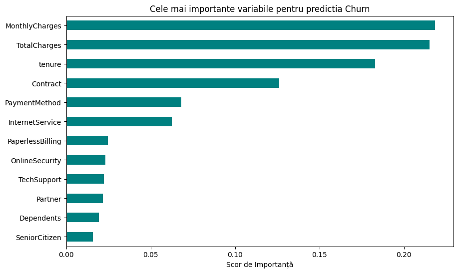
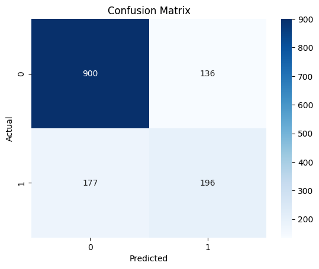

Telecom Customer Churn Prediction
Project Overview
This project uses a Random Forest Classifier to identify customers at risk of leaving a telecom provider. The model was trained on the Telco Customer Churn dataset, with a specific focus on balancing classes to improve the detection of churners.

Prediction Strategy: Recall over Precision
The model is intentionally configured to be cautious.

Business Logic: The cost of losing a customer is higher than the cost of a retention offer. Therefore, the model is tuned to capture as many potential churners as possible.

Trade-off: We accept a higher rate of False Positives (flagging loyal customers as "at risk") to minimize False Negatives (missing customers who are actually leaving).

Implementation: Used Random Oversampling on the minority class during training to force the model to recognize churn patterns more aggressively.

Technical Summary
Algorithm: Random Forest (100 estimators).

Data Balancing: Manual upsampling of the churn class (applied only to the training set).

Preprocessing: Manual mapping of categorical features and numeric conversion of TotalCharges.

Key Visualizations
1. Feature Importance
Shows that MonthlyCharges, TotalCharges, and tenure are the primary drivers of the model's decisions.

2. Confusion Matrix
Visualizes the model's performance, highlighting the high detection rate of churners (Recall).

